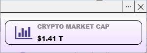

# Modular Widget

  

     
  

Modular Widget is a windows application that combines different modular solutions to solve various user problems (mostly crypto related for now).

## Current modules
* [Ethereum Module](#ethereum-module)
* [Ethereum Classic Module](#ethereum-classic-module)
* [Crypto Market Cap Module](#crypto-market-cap-module)
* [Fear & Greed Index Module](#fear--greed-index-module)
* [Media Player Module](#media-player-module)
* [CoinMarketCap Portfolio Module](#coin-market-cap-portfolio-module)

## Ethereum Module
This module is based on [Ethereum Widget](https://github.com/Ko1ors/Ethereum-Widget) application. It gives you access to most of the features of Ethereum blockchain such as price, gas tracking, block reward and wallet balance.

  

     
  

### Module settings:
* Etherscan API key (optional) - improves the overall speed of API calls. You can create a new API key at [etherscan.io](https://etherscan.io/myapikey).
* Ethereum wallet (optional) - needed to get the balance of the selected wallet. Leave empty to hide the wallet balance view.
* Update time - time between data update. The default value is 5 minutes.
* Hide price - hides the ethereum price view.
* Hide block reward - hides the average ethereum block reward view.
* Hide gas tracker - hides the ethereum has tracker view.

## Ethereum Classic Module
This module has the same functionality as the Ethereum module, but utilizes the Ethereum Classic blockchain. 
> Although Gas Tracker and Average Block Reward functions are not available in this module.

  

     
  

### Module settings:
* Ethereum Classic wallet (optional) - needed to get the balance of the selected wallet. Use the "random" option to get a balance for a random address
* Update time - time between data update. The default value is 5 minutes.

## Crypto Market Cap Module
This module displays current total cryptocurrency market cap.

  

     
  

  
### Module settings:
* No settings for now

## Fear & Greed Index Module
This module displays current crypto Fear & Greed Index.

  

     
  

## Media Player Module
This module provide Media Player that consumes windows playback sessions and allows you to control it remotely using the Modular Widget application. 
> Requires at least Windows 10 with 20H1 May 2020 Update (build 19041) installed

  

     
  

  
## CoinMarketCap Portfolio Module
This module displays current value of your main CoinMarketCap portfolio and its performance compared to yesterday.

  

     
  

  
### Module settings:
* CoinMarketCap Auth Token - used to receive information about your portfolio. [How to find the auth token.](./CoinMarketCapPortfolioModule/docs/how-to-find-auth-token.md)

## Acknowledgements
API of the following services were used:
* [etherscan.io](https://etherscan.io/)
* [blockscout.com](https://blockscout.com/)
* [coingecko.com](https://coingecko.com/)
* [alternative.me](https://alternative.me/)
* [coinmarketcap.com](https://coinmarketcap.com/)

